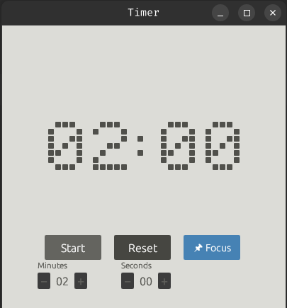

# Tiemrzzzz - Pixel Timer

A minimalist, pixel-style timer application for Linux and Windows built with Rust.



## Features

- 🎨 **Pixel-style display** - Retro-inspired digit rendering
- ⏱️ **Countdown timer** - Set minutes and seconds
- ▶️ **Simple controls** - Start, Pause, Resume, Reset
- 🖥️ **Cross-platform** - Works on Linux and Windows
- ✨ **Decorative blocks** - Tetris-inspired visual elements

## Building

### Prerequisites

- Rust (1.70 or later)
- Cargo

### Linux

```bash
# Install dependencies (Ubuntu/Debian)
sudo apt-get install libxcb-render0-dev libxcb-shape0-dev libxcb-xfixes0-dev libxkbcommon-dev libssl-dev

# Build
cargo build --release

# Run
./target/release/tiemrzzzz
```

### Windows

```powershell
# Build
cargo build --release

# Run
.\target\release\tiemrzzzz.exe
```

## Usage

1. **Set Time**: Use the + and − buttons to adjust minutes and seconds (when timer is stopped)
2. **Start**: Click "Start" to begin the countdown
3. **Pause/Resume**: Click "Pause" to stop temporarily, "Resume" to continue
4. **Reset**: Click "Reset" to return to the set duration

## Development

```bash
# Run in debug mode with hot reload
cargo run

# Run tests
cargo test

# Build optimized release
cargo build --release
```

## License

MIT License - Feel free to use and modify as you wish!
